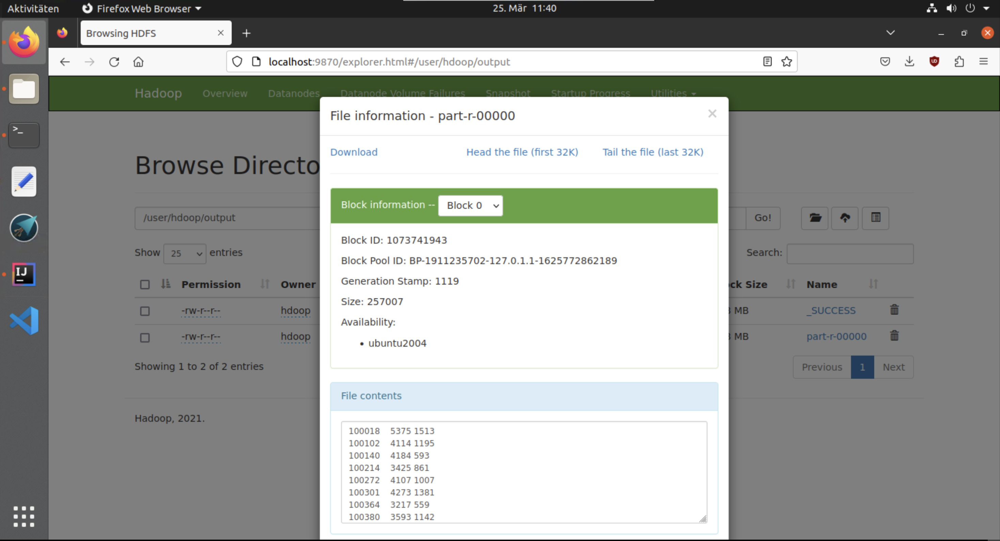
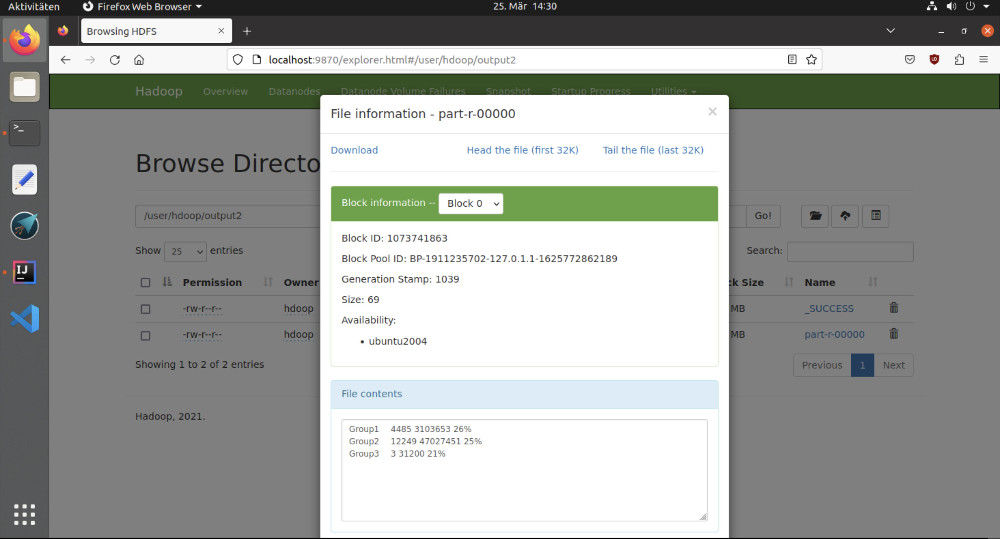
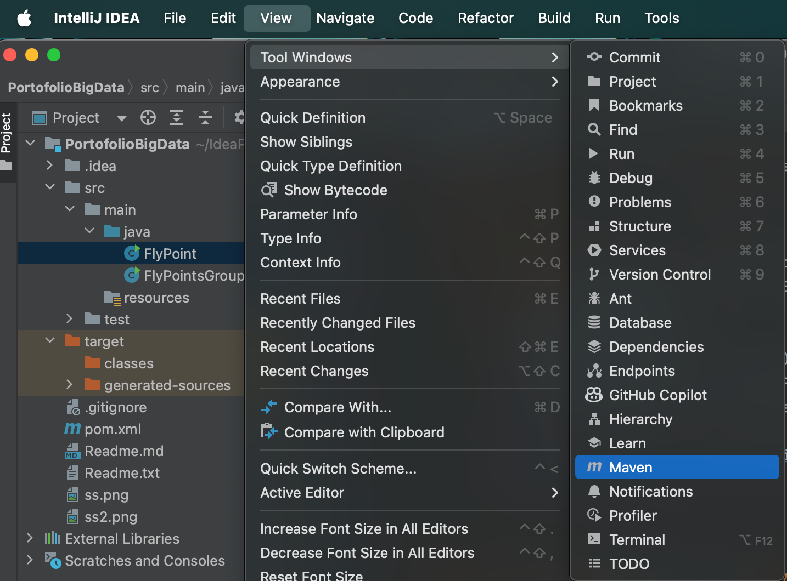
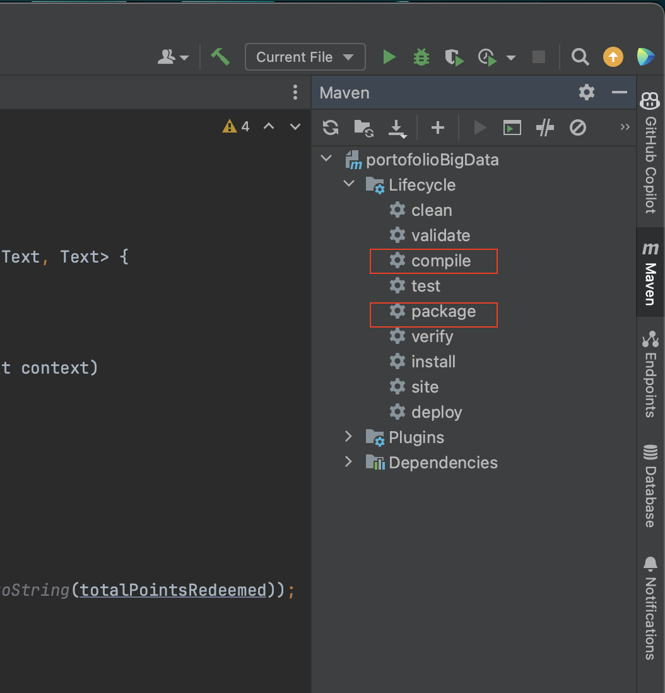

# Portfolio Big Data Storage

----

Dieses Projekt ist auch auf Github unter dem folgenden Link zu finden:
https://github.com/rakaputra12/Portofolio_Big_Data_Storage

### Raka Pradnya Putra Adita 8778662

Die vorliegende Dokumentation beschäftigt sich mit der Analyse von Daten aus der Datei fluege.csv im Rahmen einer Portfolioprüfungsaufgabe. Ziel ist es, pro Kunde die Summe der erworbenen und eingelösten Punkte zu ermitteln und Kunden in drei Gruppen basierend auf ihren erworbenen Punkten zu klassifizieren. Für jede Gruppe sollen relevante Daten wie die Anzahl der Kunden, die Summe der erworbenen Punkte und der Anteil der eingelösten Punkte berechnet werden. Zwei MapReduce-Programme werden entwickelt, um diese Schritte effizient durchzuführen, wobei jeder Schritt einen Combiner-Schritt enthält. Zur Organisation der Daten werden drei HDFS-Verzeichnisse für Input, Zwischenergebnisse und Endergebnisse definiert.


## Anleitungen

Zur Verwendung des Codes zur Berechnung der Ergebnisse aus den Beispieldaten ist eine kurze Anleitung enthalten

_**Bitte Beachten:**_ Dazu muss sichergestellt werden, dass Hadoop bereit auf dem Rechner installiert wurde, welche zum Ausführen verwendert wird. 

### 1. Umstellen auf Hadoop User
Der Befehl  wird verwendet, um die Benutzeridentität zu ändern und eine Shell-Sitzung als Benutzer "hdoop" zu öffnen. Das Präfix "su" steht für "switch user" (Benutzer wechseln).
Danach wird aufgefordert, das Passwort des Benutzers "hdoop" einzugeben. In dem Fall sollte das Passwort "student" sein.

```bash
su - hdoop
```

### 2. Starten Hadoop
Der Befehl wird typischerweise verwendet, um die Hadoop-Dienste zu starten. Dieser Befehl führt ein Skript namens start-hadoop.sh aus, das normalerweise im Hadoop-Installationsverzeichnis liegt und die erforderlichen Hadoop-Dienste wie Namenknoten, Datenknoten, Ressourcen-Manager und Knoten-Manager startet.
```bash
./start-hadoop.sh
```
### 3. Erstellen von einem Verzeichnis für Input Datei
Der Befehl wird verwendet, um ein Verzeichnis im HDFS zu erstellen. Das Flag -p sorgt dafür, dass alle übergeordneten Verzeichnisse erstellt werden, wenn sie nicht vorhanden sind.
```bash
hdfs dfs -mkdir -p input
```
### 4. Kopieren die Input Datei an Input Verzeichnis aus lokalem Verzeichnis
Der Befehl **hdfs dfs -put** wird verwendet, um eine Datei von dem lokalen Dateisystem in das HDFS (Hadoop Distributed File System) zu kopieren. Hier ist die Syntax für den angegebenen Befehl:
```bash
hdfs dfs -put <lokaler_Pfad/zur/Datei> <Zielverzeichnis_im_HDFS>
```
In dem Fall, um die Datei fluege.csv von PERSISTENT/WI2022F/BigData/PortofolioBigData/ in das HDFS-Verzeichnis input/ zu kopieren **(Der Pfad muss beachtet angepasst werden)**, wird der folgende Befehl verwendet:

In meinem Fall lautet der Befehl:
```bash
hdfs dfs -put PERSISTENT/WI2022F/BigData/PortofolioBigData/fluege.csv input/fluege.csv
```
Im generellen Anwendungsfall wird der Befehl verwendet, wenn sich die Ausgabedatei direkt im Verzeichnis PERSISTENT befindet:
```bash
hdfs dfs -put PERSISTENT/PortofolioBigData/fluege.csv input/fluege.csv
```
### 5. Ausführen des Programms 1 (FlyPoint)

Der Befehl **hadoop jar** wird verwendet, um eine Java-Anwendung als Hadoop-Job auszuführen. Hier ist die Syntax:

```bash
hadoop jar <JAR-Dateipfad> <Main-Klasse> <Eingabeverzeichnis> <Ausgabeverzeichnis>
```
In dem Fall lautet der Befehl:
```bash
hadoop jar PERSISTENT/WI2022F/BigData/PortofolioBigData/target/PortofolioBigData-1.jar FlyPoint input output
```

Im generellen Anwendungsfall wird der Befehl verwendet, wenn sich die Ausgabedatei direkt im Verzeichnis PERSISTENT befindet:

```bash
hadoop jar PERSISTENT/PortofolioBigData/target/PortofolioBigData-1.jar FlyPoint input output
```

Dabei wird die JAR-Datei PortofolioBigData-1.jar mit der Hauptklasse FlyPoint ausgeführt, wobei die Eingabedaten aus dem Verzeichnis input im HDFS gelesen und die Ausgabedaten in das Verzeichnis output im HDFS geschrieben werden. es muss sichergestellt werden, dass die Eingabedaten vorhanden sind und das Ausgabeverzeichnis nicht bereits existiert.

Falls Ausgabeverzeichnis existiert hat: [Löschen Verzeichnis](#löschen-der-output-verzeichnis)

**Bitte Beachten:**
Falls die JAR-Datei nicht vorhanden ist, müssen folgende Schritte durchgeführt werden.

[Erstellung der JAR](#erstellung-der-jar-datei-für-hadoop)

### 6. Ausführen des Programms 2 (FlyPointsGroup)
Dabei wird ein nächste Programm ausgeführt. Dabei wird die JAR-Datei PortofolioBigData-1.jar mit der Hauptklasse FlyPointsGroup ausgeführt, wobei die Eingabedaten aus dem Verzeichnis output im HDFS gelesen und die Ausgabedaten in das Verzeichnis output2 im HDFS geschrieben werden.

In meinem Fall lautet der Befehl:
```bash
hadoop jar PERSISTENT/WI2022F/BigData/PortofolioBigData/target/PortofolioBigData-1.jar FlyPointsGroup output output2
```
Im generellen Anwendungsfall wird der Befehl verwendet, wenn sich die Ausgabedatei direkt im Verzeichnis PERSISTENT befindet:

```bash
hadoop jar PERSISTENT/PortofolioBigData/target/PortofolioBigData-1.jar FlyPointsGroup output output2
```

### 7. Anzeige von Ergebnisse
Um die Ergebnisse eines Hadoop-Jobs anzuzeigen, gibt es mehrere Möglichkeiten:

1. Durchsuchen des HDFS über die Webbrowser-Schnittstelle:

- Die HDFS-Dateien können durch Öffnen des Web-Browsers und Navigieren zu http://localhost:9870/ durchsucht werden.
- Unter "Utilities" kann das Dateisystem (auf "Browse the file system") durchsucht werden.
- Mit diesem Tool kann der Inhalt des HDFS-Dateisystems überprüft werden, um die Ergebnisdateien zu finden.ems durchsuchen und nach den Ergebnisdateien suchen.

2. Verwenden von HDFS-Befehlen in der Befehlszeile:

- Durch Verwendung des Befehls `hdfs dfs -ls` kann eine Liste der Dateien im aktuellen Verzeichnis des HDFS angezeigt werden.
- Durch Verwendung des Befehls `hdfs dfs -ls /` kann eine Liste aller Dateien im Wurzelverzeichnis des HDFS angezeigt werden.
- Durch Verwendung des Befehls `hdfs dfs -cat output/*` kann der Inhalt aller Dateien im Verzeichnis "output" im HDFS angezeigt werden.


Die Ergebnisse sollten folgendes aussehen:

### Für erstes MapReduceProgramm



### Für zweites MapReduceProgramm



----

### Löschen der Output Verzeichnis

Der Befehl löscht ein gewisses Verzeichnis im HDFS sowie alle darin enthaltenen Dateien und Unterverzeichnisse.

```bash
hdfs dfs -rm -r -f <Name des Verzeichnisses>
```
In dem Fall lautet der Befehl:

```bash
hdfs dfs -rm -r -f output
```
### Erstellung der JAR Datei für Hadoop

Um eine JAR-Datei für Hadoop zu erstellen, sind diese Schritte durchzuführen:

1. Starten Sie IntelliJ in der virtuellen Maschine.
2. Öffnen Sie das Projekt/ den Ordner. (PortofolioBigData, wo **pom.xml** abgelegt ist)
3. Öffnen Sie das Dropdown-Menü "Ansicht", "Tool-Fenster", "Maven".



4. In dem neu geöffneten Fenster erweitern Sie den Lifecycle Ihres Projekts und klicken Sie auf "Kompilieren" und dann auf "Paketieren".



5. Anschließend kann wieder in vorherige Anleitungen navigiert werden. [Zurück zur Anleitung](#5-ausführen-des-programms-1-flypoint)

----
# Verarbeitungsschritte

## Das erste MapReduceProgramm

Diese erste Java-Code führt einen MapReduce-Job in Hadoop aus, um Flugpunkte für Kunden zu berechnen.
Folgendes ist eine kurze Beschreibung der Verarbeitungsschritte bei erstem Programm:

### 1. Mapper-Klasse (PointsMapper):

* Die `map`-Methode wird aufgerufen, um jeden Eingabedatensatz zu verarbeiten.
* Die Eingabedaten werden als Text eingelesen und in Teile (CSV) aufgespalten.
* Wenn der erste Teil nicht "Customer" ist (d.h., es handelt sich nicht um die Überschriften), werden die relevanten Felder extrahiert, nämlich die Kunden-ID, die verdienten Punkte und die eingelösten Punkte.
* Ein Objekt vom Typ **PointsWritable** wird erstellt und mit den verdienten und eingelösten Punkten initialisiert.
* Ein Schlüssel-Wert-Paar wird erzeugt, wobei der Schlüssel die Kunden-ID ist und der Wert das PointsWritable-Objekt.
### 2. Combiner-Klasse (PointsCombiner):

* Die `reduce-Methode wird aufgerufen, um die Werte für jeden Schlüssel aus dem Mapper zu kombinieren.
* Die verdienten und eingelösten Punkte für jeden Kunden werden summiert.
* Ein neues **PointsWritable**-Objekt wird erstellt und mit den summierten Werten initialisiert.
* Ein Schlüssel-Wert-Paar wird erzeugt, wobei der Schlüssel die Kunden-ID ist und der Wert das PointsWritable-Objekt.
### 3. Reducer-Klasse (PointsReducer):

* Die `reduce`-Methode wird aufgerufen, um die kombinierten Werte weiter zu reduzieren.
* Die verdienten und eingelösten Punkte für jeden Kunden werden erneut summiert.
* Ein Textobjekt wird erstellt, das die gesamten verdienten und eingelösten Punkte für den Kunden enthält.
* Ein Schlüssel-Wert-Paar wird erzeugt, wobei der Schlüssel die Kunden-ID ist und der Wert die Textrepräsentation der gesamten verdienten und eingelösten Punkte ist.
### 4. Hauptklasse (main-Methode):

* Der Hadoop-Job wird konfiguriert und initialisiert.
* Die Mapper-, Combiner- und Reducer-Klassen werden festgelegt.
* Die Eingabe- und Ausgabepfade werden konfiguriert.
* Das `output`-Verzeichnis dient zur Speicherung der Ergebnisse des ersten Programms und als Verzeichnis für Zwischenergebnisse für das nächste Programm. 
* Der Job wird ausgeführt, und das Programm wird beendet, abhängig von der erfolgreichen Ausführung des Jobs.

Laut Best Practices aus der Vorlesung wird in dem Fall eine Klasse **PointsWritable** definiert, die das Interface Writable implementiert. Diese Klasse dient dazu, ein benutzerdefiniertes Datenformat zu definieren, das in Hadoop MapReduce-Jobs verwendet wird.
Der Gründe dafür sind zwar:

1. **Strukturierte Daten**: Durch die Definition von benutzerdefinierten Objekten können Daten strukturiert werden. Spezifische Felder wie pointsEarned und pointsRedeemed können definiert werden, um jeweils eine bestimmte Art von Informationen zu repräsentieren. Dadurch wird die Verarbeitung der Daten während des MapReduce-Jobs einfacher und übersichtlicher.


2. **Wiederverwendbarkeit und Erweiterbarkeit**: Durch die Definition eines benutzerdefinierten Objekts wird die klare Definition und Wiederverwendbarkeit der Datenstruktur ermöglicht. Wenn sich die Anforderungen ändern oder erweitern, kann das benutzerdefinierte Objekt entsprechend angepasst werden, ohne dass der gesamte Code geändert werden muss. Dies erleichtert die Wartung und Weiterentwicklung der Anwendung.


## Das zweite MapReduceProgramm

Diese Java-Code führt einen weiteren MapReduce-Job in Hadoop aus, um Flugpunkte für verschiedene Kundengruppen zu gruppieren und zu berechnen. 
Dazu ist eine Beschreibung der Verarbeitungsschritte:

### 1. Mapper-Klasse (PointsMapper):

* Die `map`-Methode wird aufgerufen, um jeden Eingabedatensatz zu verarbeiten.
* Die Eingabedaten werden als Text eingelesen, der vorher als `Zwischergebnis`betrachet wird, und nach einem oder mehreren Leerzeichen aufgeteilt.
* Die Punkte, die ein Kunde verdient und eingelöst hat, werden extrahiert.
* Anhand der verdienten Punkte wird der Kunde in eine Gruppe eingeteilt (Gruppe 1, 2 oder 3).
* Ein Objekt vom Typ **PointsGroup** wird erstellt und mit den verdienten und eingelösten Punkten initialisiert.
* Ein Schlüssel-Wert-Paar wird erzeugt, wobei der Schlüssel die Gruppenbezeichnung ist und der Wert das PointsGroup-Objekt.
### 2. Combiner-Klasse (PointsCombiner):

* Die `reduce`-Methode wird aufgerufen, um die Werte für jeden Schlüssel aus dem Mapper zu kombinieren.
* Die verdienten und eingelösten Punkte sowie die Anzahl der Kunden in jeder Gruppe werden summiert.
* Ein neues PointsGroup-Objekt wird erstellt und mit den summierten Werten initialisiert.
* Ein Schlüssel-Wert-Paar wird erzeugt, wobei der Schlüssel die Gruppenbezeichnung ist und der Wert das PointsGroup-Objekt.
### 3. Reducer-Klasse (PointsReducer):

* Die `reduce`-Methode wird aufgerufen, um die kombinierten Werte weiter zu reduzieren.
* Die verdienten und eingelösten Punkte sowie die Anzahl der Kunden in jeder Gruppe werden erneut summiert.
* Basierend auf den kombinierten Werten wird der Prozentsatz der eingelösten Punkte berechnet.
* Ein Textobjekt wird erstellt, das die Anzahl der Kunden, die gesamten verdienten Punkte und den Prozentsatz der eingelösten Punkte für jede Gruppe enthält.
* Ein Schlüssel-Wert-Paar wird erzeugt, wobei der Schlüssel die Gruppenbezeichnung ist und der Wert die Textrepräsentation der berechneten Werte ist.
### 4. Hauptklasse (main-Methode):

* Der Hadoop-Job wird konfiguriert und initialisiert.
* Die Mapper-, Combiner- und Reducer-Klassen werden festgelegt.
* Die Eingabe- und Ausgabepfade werden konfiguriert.
* Das `output2`-Verzeichnis dient zur Speicherung der Ergebnisse des zweiten Programms.
* Der Job wird ausgeführt, und das Programm wird beendet, abhängig von der erfolgreichen Ausführung des Jobs.

Laut Best Practices aus der Vorlesung wird auch in dem Fall eine Klasse **PointsGroup** definiert.
Die Klasse `PointsGroup` ist eine Implementierung des Hadoop Writable-Interfaces, ähnlich wie die Klasse `PointsWritable`.
Im Gegensatz zur Klasse `PointsWritable` enthält diese Klasse drei Felder: **pointsEarned**, **pointsRedeemed** und **customerCount**. 
Hier wird die Anzahl der Kunden in einer bestimmten Gruppe gespeichert.

Die Entscheidung, die Anzahl der Kunden in einer bestimmten Gruppe in der Klasse `PointsGroup` zu speichern, könnte auf verschiedene Faktoren zurückzuführen sein:

- Durch die Verwendung eines Combiners können Sie die Anzahl der Kunden für jede Region bereits während der Map-Phase aggregieren, was die Datenmenge, die an die Reducer übertragen wird, reduziert.
- Wenn ein  Combiner nicht verwendet werden würde, müssten alle Daten an die Reducer gesendet und dort aggregiert werden, was ineffizient sein kann, insbesondere wenn es sich um große Datenmengen handelt.
- Auf der Aufgabenstellung muss man für beide Programm einen Combiner erstellen.
- Tatsächlich kann das zweites Programm ohne Combiner realisiert werden, aber es widerspricht der Aufgabenstellung.
- Ohne Verwendung der Combiner kann die Klasse `PointsWritable` wiederverwendet werden.
- Bei der Verwendung des Combiners muss die Objektklasse angepasst werden, da der Reducer sonst berechnet, dass die Anzahl der Kunden in einer Gruppe immer eins ist, weil sie zuvor im Combiner in einer Gruppe gespeichert wurde und bei einem Aufruf als eins gezählt wird.

## Quelle und Beitrag


Für die Entwicklung des MapReduce-Programms habe ich hauptsächlich auf Beispiele und Ressourcen aus der Vorlesung zurückgegriffen und fast kaum mit Kommilitonen zusammengearbeitet.
Darüber hinaus habe ich mir nur zwei Quellen im Internet angeschaut, um das Verständnis für die Funktionsweise von MapReduce zu vertiefen. Meiner Meinung nach ist die BeispielCode aus der Vorlesung
ist ausreichend, um die Aufgabe zu erledigen. Dabei ist nur andere Probleme aufgefordert, aber bezüglich der Logik
kann es wiederverwendet werden.


* Beispielcode und Konzepte aus der Vorlesung. **[Sales3.java]**
* Arjun Gautam's GitHub-Repository, insbesondere die WordCountHadoop-Implementierung, um die Struktur von MapReduce-Programmen zu verstehen. 
GitHub-Link: https://github.com/arjungautam1/WordCountHadoop/tree/master/src/main/java/org/codewitharjun
* TutorialsPoint für Informationen zur Verwendung von Combiners in MapReduce-Jobs. Link: https://www.tutorialspoint.com/map_reduce/map_reduce_combiners.htm


